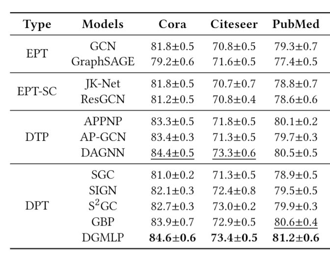

## An Experimental Evaluation of Using Deep Convolution on Graph-Structured Data


### Requirements

Environments: Xeon Gold 5120 (CPU), 384GB(RAM), TITAN RTX (GPU), Ubuntu 16.04 (OS).

The PyTorch version we use is torch 1.7.1+cu110. Please refer to the official website -- https://pytorch.org/get-started/locally/ -- for the detailed installation instructions.

To install all the requirements:

```setup
pip install -r requirements.txt
```


### Experimental Analysis

We implement ResGCN, DenseGCN, MLP+Res, MLP+Dense, SGC, and 2 GCN variants on our own in ./src/models.py:

the code of ResGCN and DenseGCN is in ./src/gcn_sc.py;

the code of MLP+Res and MLP+Dense is in ./src/mlp_sc.py;

the code of SGC is in ./src/sgc.py;

the code of GCN with $D_t=2$ and GCN with $D_p=2D_t$ is in ./src/gcn_2dt.py and ./src/gcn_dp2dt.py, respectively.

the code for printing the gradient of the first layer of GCN is in ./src/print_gradient.py;

the code for the scalability experiment is provided in ./src/scalability/, please run gen_graph.py first to generate artificial graphs; then run appnp/gcn/dgmlp.py --n="graph_size", where "graph size" varies from 100,000 to 1,000,000 with the step of 100,000.

We also provide the official code of DAGNN, S$^2$GC, and Grand under ./src/.


### DGMLP Training

To test the performance of DGMLP on the Cora, Citeseer, Pubmed dataset, please run this command:

```train
bash ./src/run.sh
```

 

###Node Classification Results:


